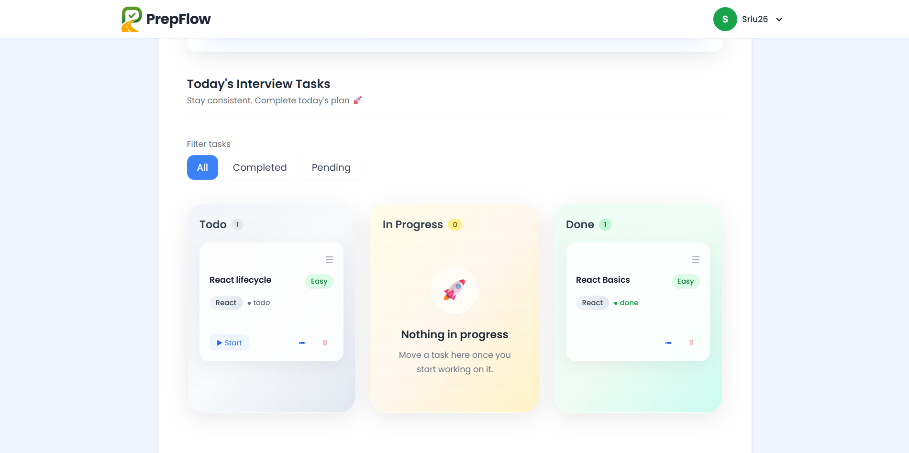
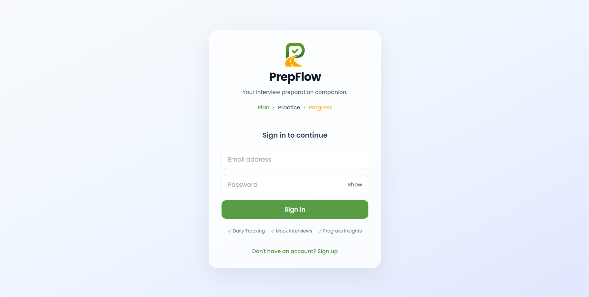

<div align="center">

# 🚀 PrepFlow

**A full-stack interview preparation planner that turns scattered prep into a structured, trackable workflow.**

Built with React, TypeScript, Redux Toolkit, and Firebase.

[](https://prep-flow-app.netlify.app/)
[](https://www.typescriptlang.org/)
[](https://react.dev/)
[](https://firebase.google.com/)

[**Live Demo**](https://prep-flow-app.netlify.app/) · [Features](#-features) · [Tech Stack](#%EF%B8%8F-tech-stack) · [Getting Started](#-getting-started)

</div>

---

## 💡 Why I Built This

Preparing for frontend interviews often meant juggling notes, spreadsheets, and to-do lists with no clear picture of progress.

**PrepFlow** solves that: a productivity-focused planner that helps developers organize daily practice, monitor consistency, visualize progress, and spot skill gaps through real-time analytics.

---

## 📸 Preview

<p align="center">
  
</p>

<p align="center">
  
</p>

---

## ✨ Features

| Category | Details |
|---|---|
| ✅ **Task Management** | Create, edit, and delete interview tasks; organize by date |
| 🔄 **Smart Rollover** | Unfinished tasks automatically move to the next day |
| 🔒 **Historical Integrity** | Past days lock automatically for accurate tracking |
| 🎯 **Status Tracking** | Completed, Pending, Skipped |
| 🏷️ **Categorization** | Tag tasks by difficulty and tech stack |
| ↕️ **Drag & Drop** | Reorder tasks intuitively |
| 📊 **Analytics Dashboard** | Daily activity, weekly progress, tech stack coverage, difficulty distribution, weekly insights |
| 🔐 **Authentication** | Firebase Anonymous & Google Sign-In |
| ☁️ **Cloud Sync** | Real-time Cloud Firestore synchronization |
| 🌙 **Theming** | Light/Dark mode |
| 📱 **Responsive** | Fully responsive UI across devices |

---

## 🛠️ Tech Stack

**Frontend**
`React` · `TypeScript` · `Redux Toolkit` · `React Router`

**Styling & Animation**
`Tailwind CSS` · `Framer Motion`

**Backend**
`Firebase Authentication` · `Cloud Firestore`

**Charts**
`Recharts`

**Drag & Drop**
`dnd-kit`

---

## 🧠 Key Concepts Implemented

- TypeScript type safety across the app
- Generic utility functions
- Custom TypeScript interfaces & types
- Redux Toolkit state management
- Firebase Authentication flows
- Firestore CRUD operations
- React Hooks
- Memoization with `useMemo`
- Derived state & computed analytics
- Component composition
- Responsive UI architecture

---

## 🚧 Technical Challenges Solved

### Smart Task Rollover
Unfinished tasks automatically move to the next day while preserving completed history.

### Accurate Historical Analytics
Past dates become read-only once they pass, so analytics always reflect what actually happened — never retroactively edited.

### Derived Analytics
Charts and statistics are computed directly from application state instead of stored redundantly, so everything stays in sync automatically.

### TypeScript Migration
Migrated the entire codebase from JavaScript to TypeScript — improving maintainability, developer experience, and compile-time safety across components, Redux slices, Firebase integration, and utility functions.

---

## 🚀 Getting Started

```bash
# Clone the repo
git clone https://github.com/saraswathi22-mac/prep-flow.git
cd prep-flow

# Install dependencies
npm install

# Run locally
npm run dev
```

---

## 👤 Author

**M A Saraswathi**
Frontend Engineer specializing in React, TypeScript, and modern web applications.

- 💼 LinkedIn — [m-a-saraswathi](https://www.linkedin.com/in/m-a-saraswathi/)
- 💻 GitHub — [saraswathi22-mac](https://github.com/saraswathi22-mac)
- 🌐 Portfolio — [saraswathi-portfolio.vercel.app](https://saraswathi-portfolio.vercel.app/)

---

<div align="center">

If PrepFlow helped you think about structuring your own prep, consider ⭐ starring the repo!

</div>
